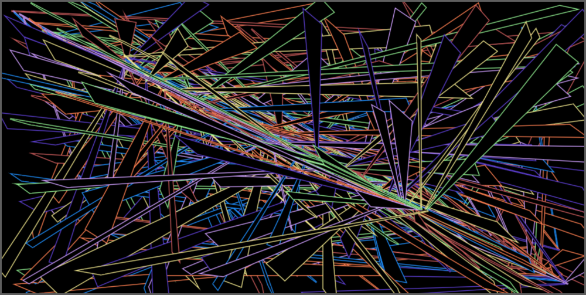
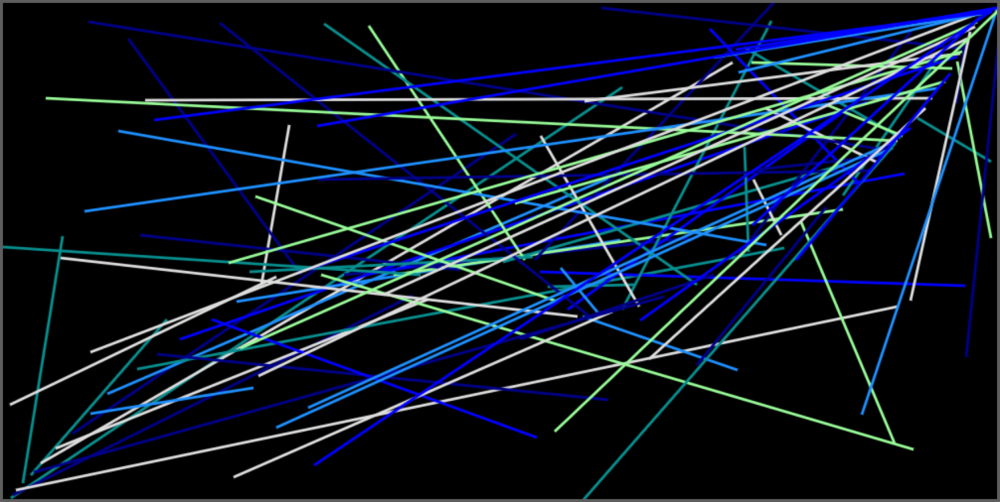
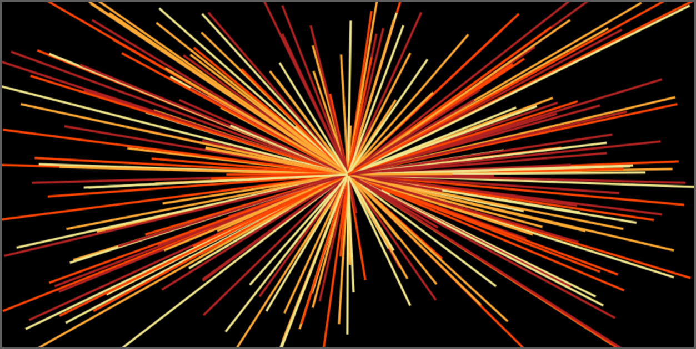
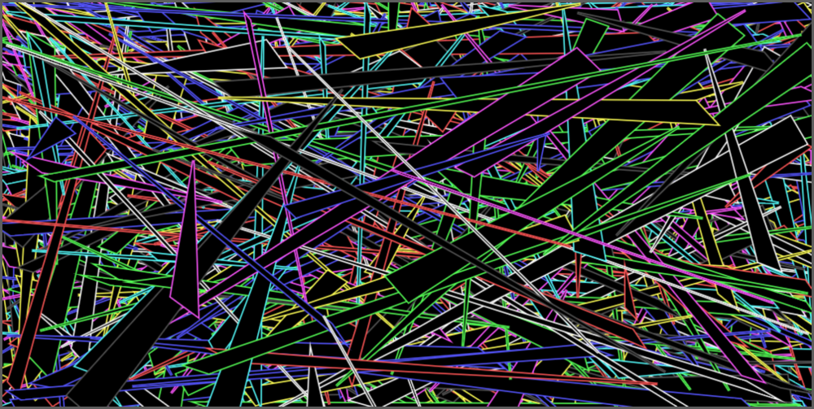
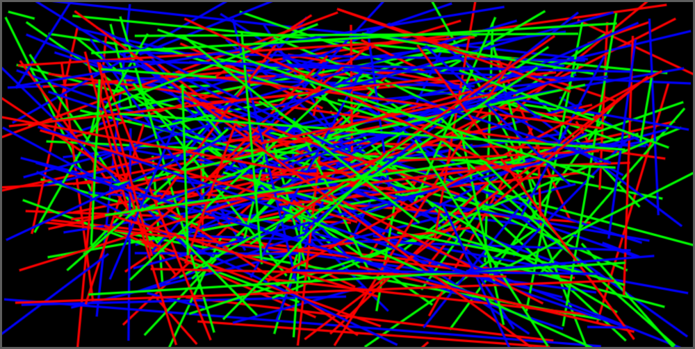
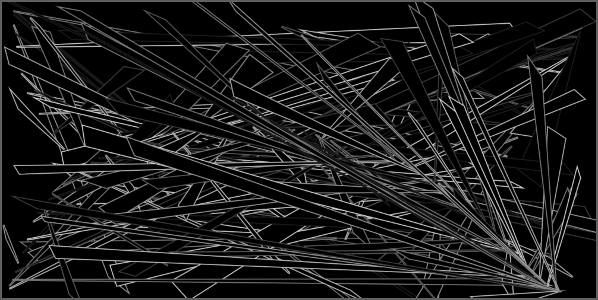
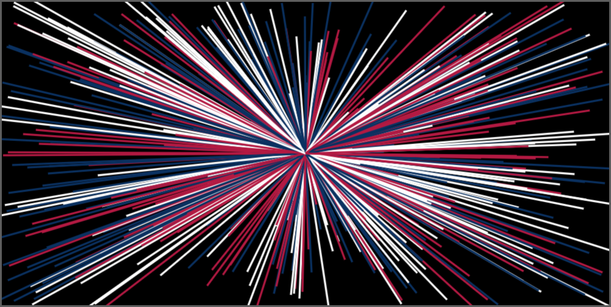
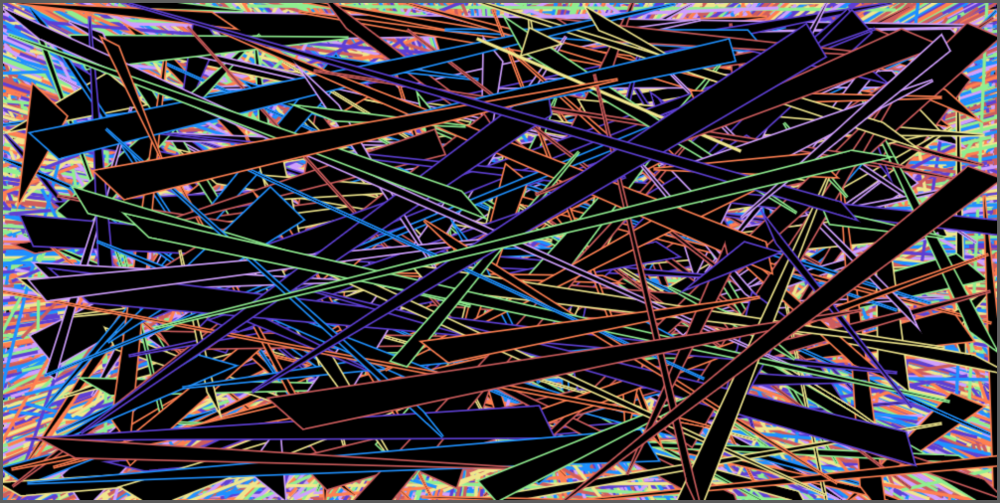
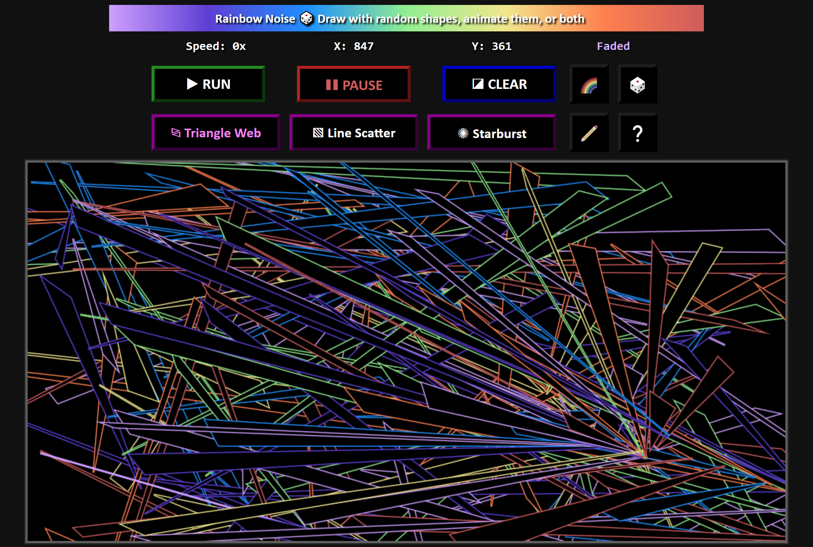
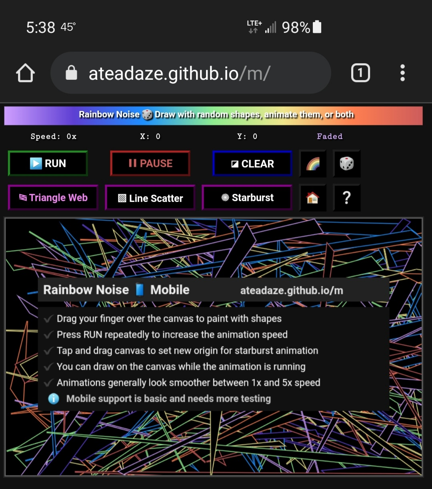

# 🦉 A Tea Daze 🛠️ My Projects

# 🎲 Yahtzee

### The classic dice game written in native JavaScript and jQuery

## 💻📱 [Desktop / Mobile](https://ateadaze.github.io/yahtzee)

* **[README](https://github.com/ATeaDaze/ateadaze.github.io/blob/main/yahtzee/README.md)**
* **[Source Code](https://github.com/ATeaDaze/ateadaze.github.io/blob/main/yahtzee/scripts/main.js)**

-----

# 🃏 Basic Blackjack

### A simple blackjack app written in (mostly) native JavaScript. Uses some jQuery for cleaner syntax. No additional libraries or anything fancy

## 💻 [Desktop](https://ateadaze.github.io/blackjack) | 📱 [Mobile](https://ateadaze.github.io/blackjack/m)

* **[README](https://github.com/ATeaDaze/ateadaze.github.io/blob/main/blackjack/README.md)**
* **[Source Code](https://github.com/ATeaDaze/ateadaze.github.io/blob/main/blackjack/scripts/main.js)**

-----

# JaNK&nbsp;&nbsp;TaBLe
## Visualize a 2-dimensional array with a table

## 💻 [Desktop](https://ateadaze.github.io/jank_table)

-----

# 🔳 Emoji Table

### Prints emojis in a table with 10 columns. Clicking an emoji copies it to the clipboard

## 💻📱 [Desktop / Mobile](https://ateadaze.github.io/emoji_table/)  (landscape mode _highly_ recommended for mobile)

* **[README](https://github.com/ATeaDaze/ateadaze.github.io/tree/main/emoji_table/README.MD)**
* **[Source Code](https://github.com/ATeaDaze/ateadaze.github.io/blob/main/emoji_table/scripts/main.js)**

-----

# 🌈 Rainbow Noise

### A time-waster app: draw with random shapes and patterns on a JavaScript canvas

## 💻 [Desktop](https://ateadaze.github.io/rainbow_noise) | 📱 [Mobile](https://ateadaze.github.io/rainbow_noise/m)

## Features
* **Draw abstract shapes** with your mouse or touch screen
  * **New patterns emerge** from random lines overlapping
* **Run animations automatically** (or combine them with drawing)
* **13 color palettes**
* **Keyboard support** (desktop version)

## Color Palettes
* 🌈 **Faded:** rainbow with desaturated colors
* 🌈 **Rainbow:** classic rainbow (red, orange, yellow, green, blue, indigo, violet)
* 🔥 **Fire:** warm and inviting
* 🧊 **Ice:** cool and refreshing
* 📊 **RGB:** red, green, blue
* ✨ **CMY:** cyan, magenta, yellow
* 🦜 **CGA-8:** an old PC/DOS video mode (8-color)
* 🦜 **CGA-16:** full 16-color CGA palette (minus pure black)
* 🎨 **Pyxel:** default color palette for [Pyxel Edit](https://pyxeledit.com/)
* 🟩 **Gameboy:** as green and hideous as it was in the 90s
* 🧨 **Patriot:**  a greater union (red, white, and blue)
* 🏁 **Grayscale:** everything from dim gray to off-white
* 🔱 **Ukraine:** the sky and fields of a beautiful nation

## Screenshots
|&nbsp;|Type of Screenshot|
|---|---|
|🖌️|**Hand drawn**|
|🎲|**Randomly generated**|

#### ⧎ Triangle Web 🖌️ Faded

#### ▧ Line Scatter 🖌️ Ice

#### ✺ Starburst 🎲 Fire

#### ⧎ Triangle Web 🎲 CGA-8

#### ▧ Line Scatter 🎲 RGB

#### ⧎ Triangle  Web 🖌️ Grayscale

#### ✺ Starburst 🎲 Patriot

#### ⧎ Triangle Web + ▧ Line Scatter + ✺ Starburst 🎲 Faded

# 💻 [Desktop](https://ateadaze.github.io/)

## Keyboard Shortcuts

### <u>General</u>

|Key|&nbsp;|
|------|------|
| **`R`** | Run animation |
|**`P`** | Pause animation |
| **`C`** | Clear screen |
|**`Enter`** |Toggle free draw mode |
| **`Spacebar`** | Next palette |
|**`?`** | Help |
|**`O`** | Origin reset (center) |
|**`*`** | Random palette |

### <u>Animation Select</u>

|Key|&nbsp;|
|------|------|
| **`T`** | Triangle web |
|**`L`** | Line scatter |
|**`S`** | Starburst |

### <u>Palettes</u>

|Key|&nbsp;|
|------|------|
| **`D`** | Faded |
|**`A`** | Rainbow (classic) |
|**`F`** | Fire |
|**`I`** | Ice |
| **`R`** | RGB |
|**`M`** | CMY |
|**`8`** | CGA-8 |
|**`6`** | CGA-16 |
| **`X`** | Pyxel Edit |
|**`Y`** | Gameboy |
|**`U`** | USA |
|**`G`** | Grayscale |
|**`K`** | Ukraine |

## On-screen controls

|Button|Key|&nbsp;|
|---|---|---|
||**`Space`**|Select the next palette|
||**`*`**|Select a random palette|
||**`Enter`**|Enable or disable free draw mode|
||**`?`**|Print help screen (overwrites canvas with confirmation)|
||**`o`**|Reset origin to center|

# Instructions
▶  **Press RUN repeatedly** to increase the animation speed

✔️ Animations generally look smoothest between 1x and 5x speed

✔️ You can draw on the canvas while the animation is running

## Instructions (Desktop)
✏️ **Click and drag on the canvas** to draw shapes

✏️ Free drawing mode paints shapes with mouse movement (no clicking)

✔️ **Press spacebar** to select the next color palette

🏠 **Click the canvas** to set a new origin for the starburst animation (setpoint=canvas.mouseup)

# 📱 [Mobile](https://ateadaze.github.io/m/)

## Instructions (Mobile)
🖌️ **Tap and drag across the canvas** to paint with shapes

🏠 **Tap and drag canvas** to set new origin for starburst animation (setpoint=canvas.touchup)

ℹ️&nbsp;&nbsp;**Mobile version is basic** (works but needs work)

# Changes / Issues / Fixes
* [X] Release a mobile version with touch support
* [X] Separate `updateUI()` function into `updateBanner()` and `updateButtons()`
* [X] Remove style changes from `setBrushColor()`
* [X] Fix button colors not updating
* [X] Change origin setpoint to `mousedown`  (instead of `mouseup`)
* [X] Added custom mouse cursors
* [X] Set indentation style to `2` tabs
* [X] Add toggle function to hide/show keyboard map
* [ ] Add more variety: shapes, colors, brush width, etc. (experiment)
* [ ] Replace all HTML legacy tags with CSS

### Desktop
* [X] Expand `mousemove` listener to entire document body: wilder but more satisfying
* [X] Add a button to toggle drawing mode
* [X] Get `actionListener` working properly with `mousemove` *and* `mousedown` events (similar to mobile drawing)
* [ ] Optimize resolution for the most common displays
### Mobile
* [X] Disable swipe down refresh gesture
* [ ] Needs more testing: limited testing done with Chrome device emulation and an S10+
* [ ] Optimize resolution and settings for mobile displays

# Technical Information
**Languages:** **JavaScript** for the main app, **HTML** for page elements, and **CSS** for formatting
## **Source Code**
**Desktop:** [JavaScript](/scripts) ([main.js](/scripts/main.js), [drawCanvas.js](/scripts/drawCanvas.js)), [HTML](index.html), [CSS](/styles/rainbow_noise.css)

**Mobile:** [mobileMain.js](/m/scripts/mobileMain.js), [mobileDrawCanvas.js](/m/scripts/mobileDrawCanvas.js), [HTML](/m/index.html), CSS (same as desktop)

> **Question of the Day:** if "depository" is shortened to "depot" then why isn't "repository" shortened to "repot?" Better yet, why not shorten depot to "depo?"
