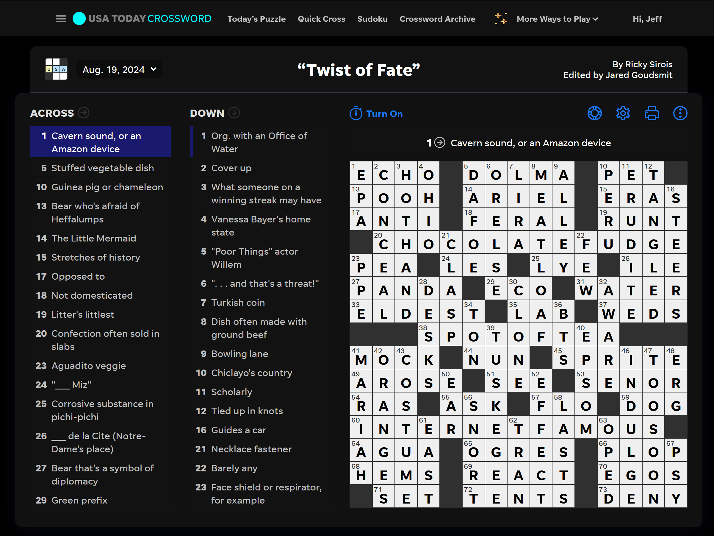

# Dark Mode for USA Today Crossword Puzzle

Adds a basic dark mode theme to USA Today's [Crossword Puzzle](https://puzzles.usatoday.com/), [Quick Cross](https://puzzles.usatoday.com/quick-cross), and [Puzzle Archives](https://puzzles.usatoday.com/crosswords-archive). The theme is set by external CSS which is loaded by Tampermonkey/Greasemonkey

> [!IMPORTANT]
> **Requires:** Greasemonkey or Tampermonkey, JavaScript enabled in browser

## Instructions

1. [Download](https://github.com/ATeaDaze/ateadaze.github.io/raw/refs/heads/main/usa_dark_cross/main.user.js) the userscript from the direct link
2. Confirm installation of the script file `main.user.js` in Tampermonkey or Greasemonkey [^1]

> [!NOTE]
> Enable the "Dark Mode for USA Today Crossword Puzzle" userscript in the dashboard if it's disabled by default

> [!TIP]
> (Optional) Test and verify its working: https://puzzles.usatoday.com/

## Requirements

|| Tampermonkey| Greasemonkey|
|---|---|---|
||[Dowload for Firefox](https://addons.mozilla.org/en-US/firefox/addon/tampermonkey/)|[Dowload for Firefox](https://addons.mozilla.org/en-US/firefox/addon/greasemonkey/)|
||[Dowload for Chrome](https://chromewebstore.google.com/detail/tampermonkey/dhdgffkkebhmkfjojejmpbldmpobfkfo?pli=1)|Not Available|

## Additional Information

I made this because USA Today doesn't have native dark mode for their crossword puzzles. I tried setting up a static theme with [Dark Reader](https://darkreader.org/) but I had to manually disable and enable the extension to get my sheet to load. It's a great extension but static CSS did not work for me

## Source Code

* **JavaScript:** [main.user.js](main.user.js)
* **CSS:** [style.css](style.css)

[^1]: You can click the direct download link and click `[Install]` to confirm it *or* copy-and-paste the contents of `main.user.js` into a new userscript manually

