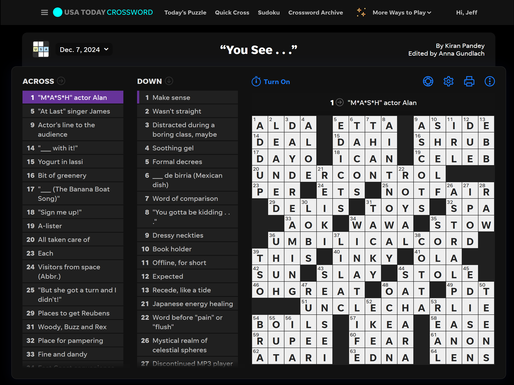
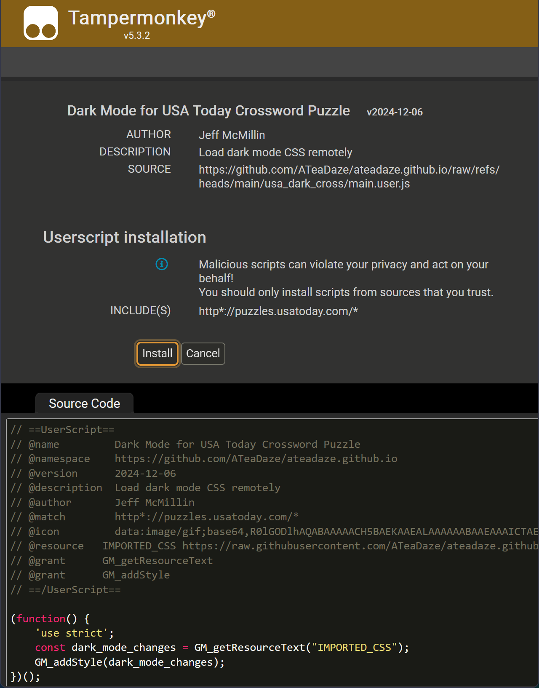
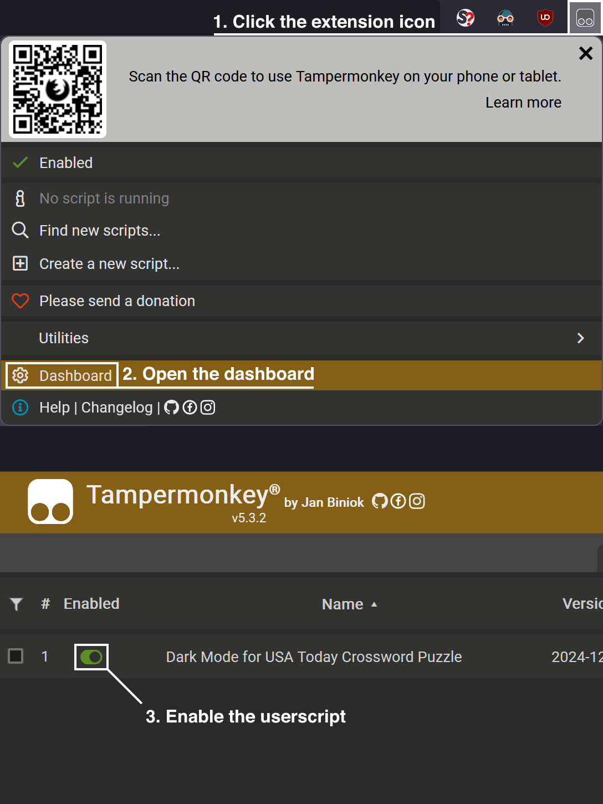

# Dark Mode for USA Today Crossword Puzzle
* Applies a dark mode theme to USA Today's Crossword Puzzle, Quick Cross, and Puzzle Archives
* Theme is set by external CSS loaded with a local userscript

> [!IMPORTANT]
> ### **[Requirements](#requirements)**
> * **Greasemonkey** *(or)* **Tampermonkey** browser extension
> * **JavaScript enabled** in browser



## Installation

* [**Download userscript** from this direct link](https://github.com/ATeaDaze/ateadaze.github.io/raw/refs/heads/main/usa_dark_cross/main.user.js)
* **Install userscript** in Greasemonkey or Tampermonkey:
  * Click `[Install]` buttom to confirm installation of `main.user.js` in your browser

You can also install the script locally or manually [^1]

> [!TIP]
> ### (**Optional**)
> Test and verify it's working: https://puzzles.usatoday.com/



> [!NOTE]
> Enable the "Dark Mode for USA Today Crossword Puzzle" userscript in the [dashboard](#open-the-dashboard) if it's disabled for some reason

## Requirements

||<br>Tampermonkey|<br>Greasemonkey|
|:-:|:-:|:-:|
|<br>**Firefox**|[Download](https://addons.mozilla.org/en-US/firefox/addon/tampermonkey/)|[Download](https://addons.mozilla.org/en-US/firefox/addon/greasemonkey/)|
|<br>**Chrome**|[Download](https://chromewebstore.google.com/detail/tampermonkey/dhdgffkkebhmkfjojejmpbldmpobfkfo?pli=1)|N/A|

## Additional Information

I made this because USA Today doesn't have native dark mode for their crossword puzzles. I tried setting up a static theme with [Dark Reader](https://darkreader.org/) but I had to manually disable and enable the extension to get my sheet to load. It's a great extension but static CSS did not work for me

## Source Code

### User Script

This script loads an external CSS file after the page loads

```javascript
// ==UserScript==
// @name         Dark Mode for USA Today Crossword Puzzle
// @namespace    https://github.com/ATeaDaze/ateadaze.github.io
...
// @match        http*://puzzles.usatoday.com/*
// @icon         https://ateadaze.github.io/images/owl_cave-small.png
// @resource     IMPORTED_CSS https://raw.githubusercontent.com/ATeaDaze/ateadaze.github.io/refs/heads/main/usa_dark_cross/style.css
// @resource     https://ateadaze.github.io/scripts/jquery-3.7.0.min.js
// @grant        GM_getResourceText
// @grant        GM_addStyle
// @run-at       document-end
// ==/UserScript==

(function() {
    'use strict';
    let dark_mode_changes = GM_getResourceText("IMPORTED_CSS");
    GM_addStyle(dark_mode_changes);
})();
```

### Stylesheet

I use the element inspector in Firefox to find class names and IDs. Then, I simply overwrite the selector property values like any other CSS file

```css
/* The main barrier is a lot of websites use generated class names and IDs like this */
.class-XDbiO7Zm- {
 backgound-color: #000000;
}
```

* **JavaScript:** [main.user.js](main.user.js)
* **CSS:** [style.css](style.css)

## Issues and Fixes

* [x] Change background colors for the active word and letter
* [x] Add stylesheets for "Quick Cross" and "Player Stats" pages
* [x] Add hover effects to links, hint board, and stats page
* [x] Set userscript to run *after* page loads: `@run-at document-end`
* [x] Fix broken selectors for game board background colors
* [ ] Add a high contrast mode (no white on the board)
* [ ] Page footer is still light / white
  * I probably need to extend the user script's namespace to include the URL of the footer
* [ ] Specific `<div>` styles appear to get overwritten on page load

Setting the script to run after the page loads fixed some of the unset styles. There are still specific classes prone to the issue. When I say "specific" I mean *very* specific elements (e.g. exact same class each time). These are a few of the known classes that can revert to white: `.class-IO9zu-5, .class-UyzvkQC`

```css
/* It usually works but sometimes it doesn't */
.class-bT5q-gr, .class-IO9zu-5, .class-6F1zccC, .class-UyzvkQC, .class-iZZVNyh {
  background-color: #111111;
  border: 1px solid #232323;
}
```

I have looked into this one but not deeply. It's hard to keep track of selectors when they have randomly-generated names. My first guess would be a host-side script overwriting my values when the layout changes

> [!NOTE]
> ### **Workaround:**
> Open the [puzzle archives](https://puzzles.usatoday.com/crosswords-archive), refresh the page, then click a link [^2]

## Open the Dashboard



<p align="center">
  🔝&nbsp;<a href="#dark-mode-for-usa-today-crossword-puzzle">Scroll to Top</a>&nbsp;🔝
</p>

[^1]: You can use the direct download link and click `[Install]` to confirm it, download and install `main.user.js` locally, *(or)* copy-and-paste the contents of `main.user.js` into a new userscript manually. The first option is the easiest and recommended
[^2]: All styles appear to work if you click-through all subsequent links in the same window and tab (yeah, I don't know either). Skill issue or CSS being weird
