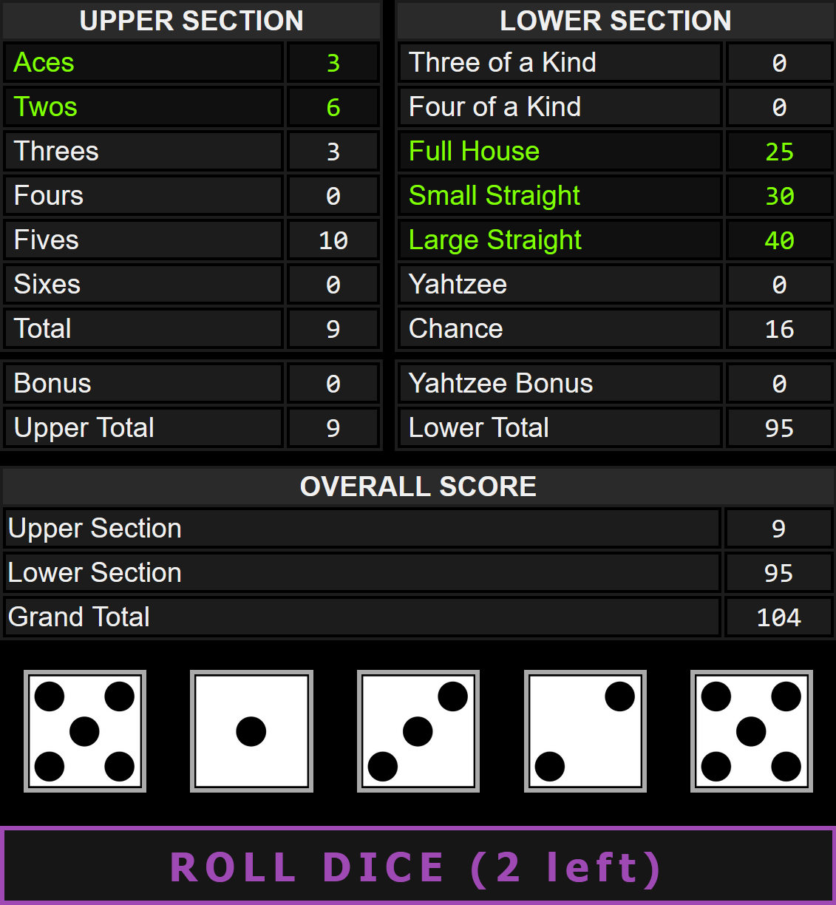

# 🎲 Yahtzee

### The classic dice game written in JavaScript and jQuery

## 💻📱 [Desktop / Mobile](https://ateadaze.github.io/yahtzee)

<picture>

</picture>

## Features
* **Play Yahtzee in your browser without ads**
* **Uses the official rules** set by Hasbro in their [manual](https://www.hasbro.com/common/instruct/yahtzee.pdf) **†**
* **Simple UI**: no login, ads, or animations to sit through
* **Sound effects** provide feedback (without becoming a distraction)
* **Cross-platform**: works on desktop and mobile
  * Portrait mode *highly recommended* for most mobile screens
* **High scores** are tracked using local storage

**†** There is one exception to this: Joker scores do not require you to enter an upper score first. This deviates from the official rules but I plan to implement it to make it 100% accurate. You can always avoid entering a lower score as a Joker if your upper score has not been used

> **NOTE:** I have already spent a lot of time working on this (too much time). I plan on updating it with some QOL improvements and fixes. However, I am pretty sure I'm the *only person in the world* who plays it (no promises)

* **[README](https://github.com/ATeaDaze/ateadaze.github.io/blob/main/yahtzee/README.md)**
* **[Source Code](https://github.com/ATeaDaze/ateadaze.github.io/blob/main/yahtzee/scripts/main.js)**

## Keyboard Map (desktop)

&nbsp;|Description
---|:--
|**` R `** |**Roll:** roll dice
|**` 1 `** |Select the 1st die
|**` 2 `** |...
|**` 3 `** |...
|**` 4 `** |...
|**` 5 `** |Select the 5th die

### Key:
* [TEST] = Added, needs more testing
* [WIP] = Work in progress
* ~~Strikethrough~~ = Fixed or Cancelled

# BUGS

* [x] Multiple Yahtzees are not properly handled (Jokers)
  * [x] Added a check for Jokers to allow scoring in the valid sections
  * [ ] [WIP] Players can enter lower scores even if the upper score Joker is empty

I didn't notice this bug for a while because it's an extremely rare condition (and lucky)

* [ ] Keyboard shortcuts circumvent some important checks and flags
  * [ ] Example: you can hold all of your dice between turns with the number keys
    * [ ] Getting Yahtzee on every turn is amusing but it's not supposed to happen (obviously)
* [ ] Some SFX overlap or overwrite each other (e.g. upper bonus and new high score sounds)

# FIXES

* [x] Score check for Jokers does not work properly
  * **Cause:** function that checks for valid lower scores was called but not implemented (oops)
  * **Fix:** added a `checkAllUpperScores()` function, added another call to it in `updateScorePreviews()` which used an identical code block

```javascript
findAllUpperScores(); // Called a non-existant function (line 276)

// Implemented the function
function findAllUpperScores() {
  findSumOfEqualValueDice(previewScoreAces, userScoreAces, 1, txtScoreAces);
  findSumOfEqualValueDice(previewScoreTwos, userScoreTwos, 2, txtScoreTwos);
  findSumOfEqualValueDice(previewScoreThrees, userScoreThrees, 3, txtScoreThrees);
  findSumOfEqualValueDice(previewScoreFours, userScoreFours, 4, txtScoreFours);
  findSumOfEqualValueDice(previewScoreFives, userScoreFives, 5, txtScoreFives);
  findSumOfEqualValueDice(previewScoreSixes, userScoreSixes, 6, txtScoreSixes);
}

// I never said it was an elegant solution (or even a good one) but it works

```

# TODO

## General
* [ ] [WIP] Add keyboard shortcuts for dice rolls and selection
* [ ] Allow players to undo their last score submission (until next turn begins)
  * [ ] Use a button or find a more elegant solution for scoring
* [x] Disable rows that have already been scored
* [x] Temporarily disable all rows unless a score is being selected (players could select scores at any time leading to a lot of unintentional zeros)
* [x] Add a basic high score system with local storage
* [x] Add sound effects for dice selection, rolls, and bonuses
* [x] Add alternate stylesheets for smaller viewports
# 🎲 Yahtzee

### The classic dice game written in JavaScript and jQuery

## 💻📱 [Desktop / Mobile](https://ateadaze.github.io/yahtzee)

<picture>

</picture>

## Features
* **Play Yahtzee in your browser without ads**
* **Uses the official rules** set by Hasbro in their [manual](https://www.hasbro.com/common/instruct/yahtzee.pdf) **†**
* **Simple UI**: no login, ads, or animations to sit through
* **Sound effects** provide feedback (without becoming a distraction)
* **Cross-platform**: works on desktop and mobile
  * Portrait mode *highly recommended* for most mobile screens
* **High scores** are tracked using local storage

**†** There is one exception to this: Joker scores do not require you to enter an upper score first. This deviates from the official rules but I plan to implement it to make it 100% accurate. You can always avoid entering a lower score as a Joker if your upper score has not been used

> **NOTE:** I have already spent a lot of time working on this (too much time). I plan on updating it with some QOL improvements and fixes. However, I am pretty sure I'm the *only person in the world* who plays it (no promises)

* **[README](https://github.com/ATeaDaze/ateadaze.github.io/blob/main/yahtzee/README.md)**
* **[Source Code](https://github.com/ATeaDaze/ateadaze.github.io/blob/main/yahtzee/scripts/main.js)**

## Keyboard Map

&nbsp;|Description
---|:--
|**` R `** |**Roll:** roll dice
|**` 1 `** |Select the 1st die
|**` 2 `** |...
|**` 3 `** |...
|**` 4 `** |...
|**` 5 `** |Select the 5th die

### Key:
* [TEST] = Added, needs more testing
* [WIP] = Work in progress
* ~~Strikethrough~~ = Fixed or Cancelled

# BUGS

* [x] Multiple Yahtzees are not properly handled (Jokers)
  * [x] Added a check for Jokers to allow scoring in the valid sections
  * [ ] [WIP] Players can enter lower scores even if the upper score Joker is empty

I didn't notice this bug for a while because it's an extremely rare condition (and lucky)

* [ ] Keyboard shortcuts circumvent some important checks and flags
  * [ ] Example: you can hold all of your dice between turns with the number keys

Getting Yahtzee on every turn is amusing but it's not supposed to happen (obviously)

* [ ] Some SFX overlap or overwrite each other (e.g. upper bonus and new high score sounds)

# FIXES

* [x] Score check for Jokers does not work properly
  * **Cause:** function that checks for valid lower scores was called but not implemented (oops)
  * **Fix:** added a `checkAllUpperScores()` function, added another call to it in `updateScorePreviews()` which used an identical code block

```javascript
findAllUpperScores(); // Called a non-existant function (line 276)

// Implemented the function
function findAllUpperScores() {
  findSumOfEqualValueDice(previewScoreAces, userScoreAces, 1, txtScoreAces);
  findSumOfEqualValueDice(previewScoreTwos, userScoreTwos, 2, txtScoreTwos);
  findSumOfEqualValueDice(previewScoreThrees, userScoreThrees, 3, txtScoreThrees);
  findSumOfEqualValueDice(previewScoreFours, userScoreFours, 4, txtScoreFours);
  findSumOfEqualValueDice(previewScoreFives, userScoreFives, 5, txtScoreFives);
  findSumOfEqualValueDice(previewScoreSixes, userScoreSixes, 6, txtScoreSixes);
}

// I never said it was an elegant solution (or even a good one) but it works

```

# TODO

## General
* [ ] [WIP] Add keyboard shortcuts for dice rolls and selection
* [ ] Allow players to undo their last score submission (until next turn begins)
  * [ ] Use a button or find a more elegant solution for scoring
* [x] Disable rows that have already been scored
* [x] Temporarily disable all rows unless a score is being selected (players could select scores at any time leading to a lot of unintentional zeros)
* [x] Add a basic high score system with local storage
* [x] Add sound effects for dice selection, rolls, and bonuses
* [x] Add alternate stylesheets for smaller viewports
